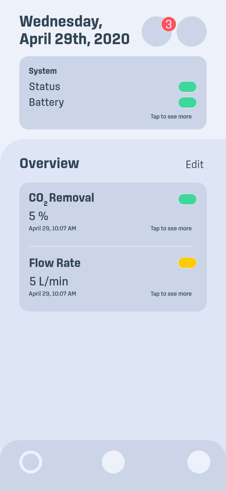
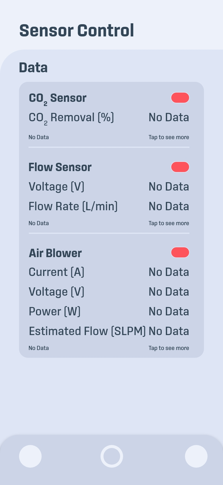
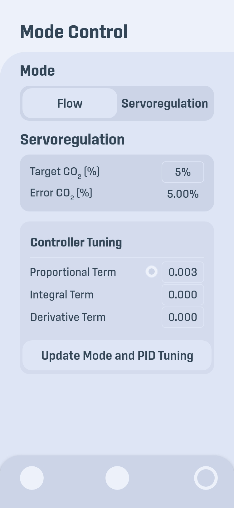
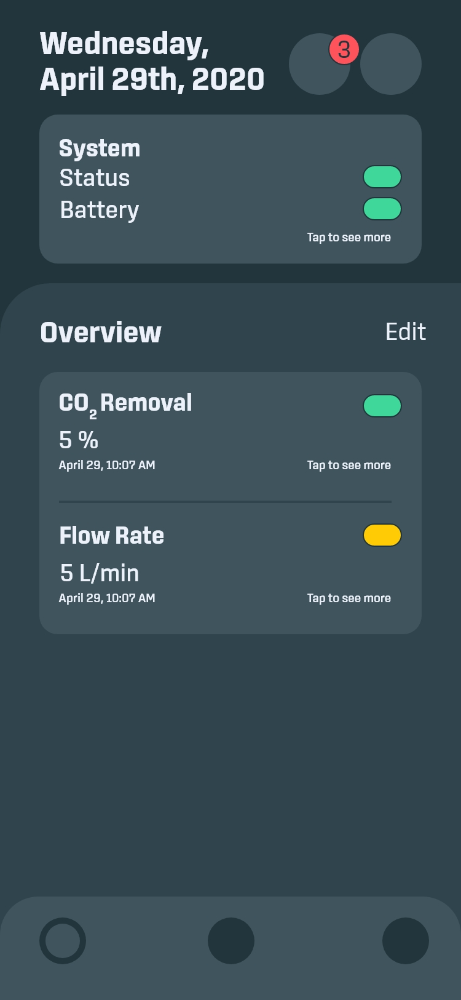
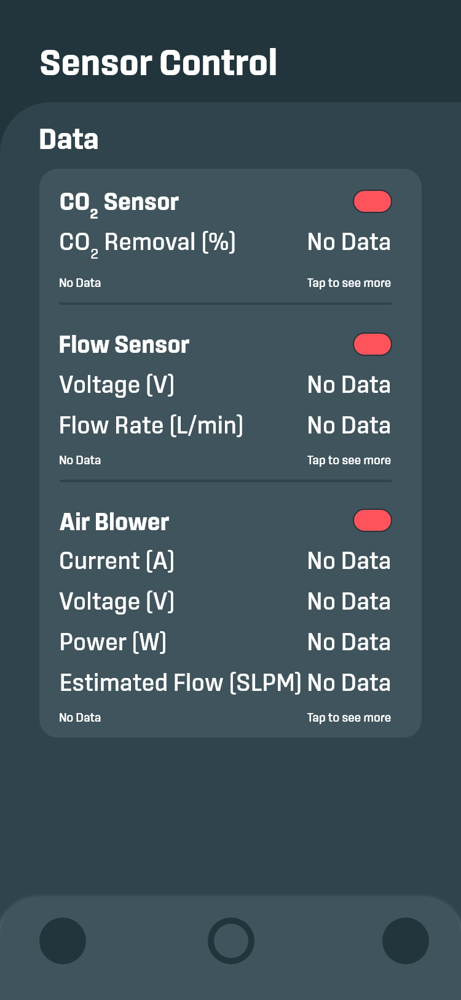
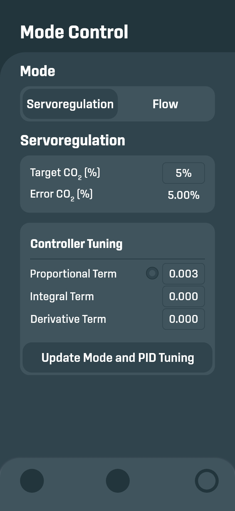

# artificial_lung

This project is a mobile application for iOS and Android platforms for wearable artificial lung technology designed at the Extracorporeal Life Support (ECLS) Lab at the University of Michigan.

<p align="center">
    <a>
        
    </a>
    <a>

    </a>
    <a>

    </a>
</p>

<p align="center">
    <a>
        
    </a>
    <a>
        
    </a>
    <a>
        
    </a>
</p>

## Install

Clone the repository with the 'clone' command, or just download the zip.

```
$ git clone git@github.com:philspan/artificial_lung.git
```

For more information about the Flutter installation process, check out the [official installation guide](https://flutter.io/get-started/install/).

Install dependencies from pubspec.yaml by running `flutter packages get` from the project root (see [using packages documentation](https://flutter.io/using-packages/#adding-a-package-dependency-to-an-app)).

## Authors

- **Phil Spannagel** - [GitHub](https://www.github.com/philspan), [LinkedIn](https://linkedin.com/in/philspannagel)
